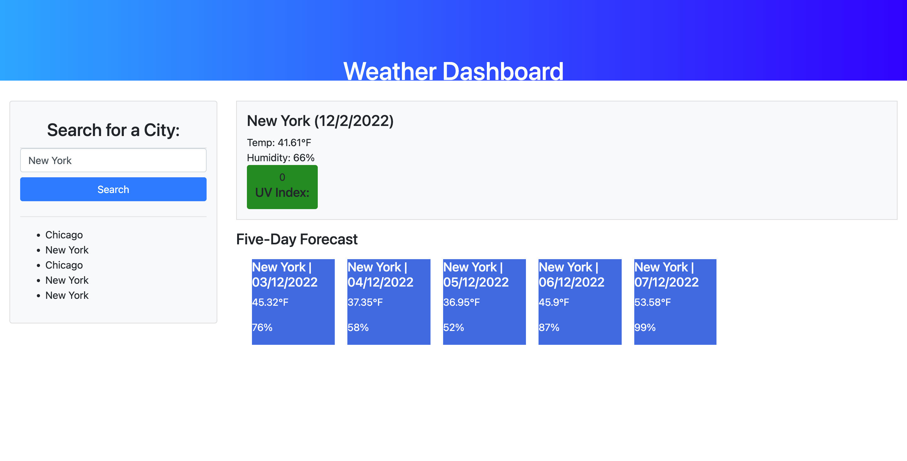

# WEATHER DASHBOARD:

## WHAT IT IS:
A simple weather app where you could type in a city name, and current weather forecast would be generated, in addition to the next 5-days forecast

## TECHNOLOGIES:
Powered by JS, HTML, and CSS

## HOW THE SITE LOOKS: 

## DEPLOYED LINK: 
https://phuonghoang68.github.io/Weather-dashboard/

